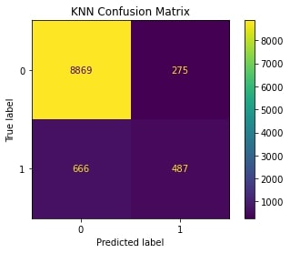
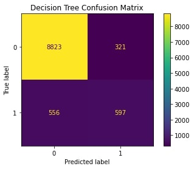

# Comparing Classifiers

This notebook explores a dataset of a Portuguese banking institution's
telemarketing campaigns to customers. Our goal is to help inform the banking
institution what model would work best to predict whether or not a customer will 
subscribe to a term deposit. This can help save the bank on time and cost 
in terms of targeting the right customers rather than just blindly calling 
everybody and hoping for the best. We have explored the most important features
after looking at the coefficients of a basic logistic regression model while
also finding the best model at accurately predicting customers' responses.
From our modeling, we found that nearly all models performed the same between
logistic regression, K-Nearest Neighbors, decision trees, and support vector
machines; however, my recommendation based on our results lies with utilizing
decision trees as that has the best tradeoff between the performance metrics of
accuracy, precision, and recall compared to the training time. With this notebook,
we can hand these findings over to the bank in order for them to start utilizing
the decision tree model as a plug-and-play model that is ready to go since we
have already trained it on their past data. This will hopefully yield higher success
when it comes to getting customers to subscribe to a term deposit. 

Below are the results of my modeling:

Even though the models all performed relatively similarly, the decision tree just
narrowly beats out the other two models (after hyperparameter tuning). The train
time for the decision tree was also not that great, leading me to recommend the
decision tree as the best model for our Portuguese bank to use.